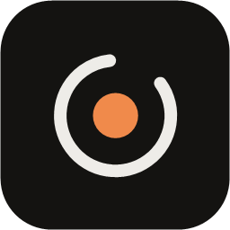

<p align="center">
  
</p>

<h1 align="center">noc</h1>
<p align="center"><em>Minha IA. Meu computador. Meus dados.</em></p>

O **Noc** transforma o seu PC num servidor pessoal de IA. Os modelos rodam no **LM Studio** do computador, e você conversa com eles pelo **app Android**, de qualquer lugar: na mesma Wi-Fi ou pelo 4G/5G. A experiência é de app de IA de verdade, mas a inferência continua no seu PC e as conversas continuam suas.

```
 Android (Noc)  ──  Wi-Fi: direto pela rede local  ──►  PC (Noc Companion)  ──►  LM Studio (127.0.0.1)
      │                                                     ▲
      └── fora de casa: relay cifrado (só repassa bytes) ───┘
```

## Downloads

Baixe na página de [**Releases**](https://github.com/alanaraujo-bit/noc/releases/latest):

| Arquivo | Para quê |
|---|---|
| `Noc-Companion-Setup-1.1.0.exe` | Instalador do Companion para Windows 10/11 (64 bits). Não precisa do .NET instalado. |
| `Noc-1.1.0.apk` | App Android 8.0+ (instale direto no celular; atualiza o 1.0 sem perder conversas). |

## Como começar (5 minutos)

**No PC**
1. Instale o [LM Studio](https://lmstudio.ai) e baixe um modelo de conversa (ex.: Qwen, Llama, Gemma).
2. Rode o `Noc-Companion-Setup-1.1.0.exe`. Na pergunta de instalação, prefira "para todos os usuários", porque isso cria a regra de firewall para a conexão direta na Wi-Fi.
3. O Companion abre sozinho, encontra o LM Studio e liga o servidor dele se precisar. Ele também inicia junto com o Windows.

**No Android**
1. Baixe o `Noc-1.1.0.apk` no celular e abra o arquivo. O Android vai pedir para permitir "instalar apps desta fonte"; permita para o navegador ou gerenciador de arquivos que você usou.
2. Abra o Noc e siga a apresentação.
3. No PC, clique em **Parear celular** e aponte a câmera para o QR Code. Sem câmera, use a aba **Código**: digite o código no celular e confirme no PC o número de verificação.
4. O app testa a conexão e mostra a primeira resposta do seu modelo. Pronto.

Depois do primeiro pareamento não há mais nada para configurar. Deixe o PC ligado e o Noc cuida do resto.

## O que o app faz

- **Chat completo**: streaming em tempo real, Markdown (tabelas, listas, citações), código com destaque de sintaxe e botão copiar por bloco, fórmulas LaTeX legíveis, e o raciocínio do modelo em um bloco recolhível.
- **Controle da resposta**: parar, continuar, regenerar, gerar com outro modelo, editar uma pergunta (cria ramos navegáveis ‹ 1/2 ›), excluir, selecionar texto, compartilhar, exportar a conversa em `.md`.
- **Estatísticas**: tokens/s, tempo até o primeiro token, contexto usado e rota (rede local ou remota).
- **Conversas**: histórico com busca no conteúdo (ignora acentos), fixar, pastas, arquivar com um gesto (e desfazer), duplicar, renomear. Os títulos são gerados pelo próprio modelo.
- **Perfis de modelo**: ⚡ Rápido, ◆ Inteligente e ◈ Profundo, cada um apontando para um modelo do PC, com nomes amigáveis ("Qwen 3.5 9B" em vez do nome do arquivo). O Noc distribui os modelos sozinho pela VRAM da GPU e você pode trocar quando quiser, até no meio de uma conversa: cada resposta mostra discretamente qual modelo respondeu.
- **Modelos**: veja os modelos do PC com capacidades (visão, raciocínio), tamanho, quantização e se cabem na GPU; carregue, descarregue, favorite, renomeie e rode um **teste de desempenho** real (tok/s, tempo até o primeiro token, tempo de carga, leitura de imagem). O contexto é escolhido automaticamente pelo que cabe na VRAM, medido de verdade a cada carga, com modo avançado para fixar à mão.
- **Importação automática**: baixou um `.gguf` na pasta Downloads? O Companion encontra, identifica (arquitetura, quantização, contexto, visão), junta o arquivo de visão (`mmproj`) certo, corrige arquivos em formato antigo e entrega ao LM Studio. Nada de mover arquivos à mão.
- **Imagens**: botão **+** com câmera, galeria, colar e arquivos; várias imagens por mensagem; compartilhar de outro app direto para o Noc. As imagens são comprimidas mantendo texto legível (prints, telas de erro) e só são aceitas por modelos com visão; o app oferece trocar de modelo quando precisa.
- **Ditado por voz**: toque ou segure o microfone e fale em português. A transcrição roda no seu PC (Whisper, sem nuvem), entende termos técnicos, números e um dicionário pessoal (Ajustes → Voz e ditado), e o texto volta para a caixa de mensagem para você revisar antes de enviar.
- **Perfis e prompts**: Programação, Pesquisa, Criatividade, Resposta rápida, Análise profunda, ou os seus. Biblioteca de prompts de sistema com favorito e padrão.
- **Ajustes finos** (escondidos até você precisar): temperatura, top P/K, min P, penalidades, máximo de tokens, seed, sequências de parada, contexto e raciocínio ligado/desligado.
- **Anexos**: arquivos de texto e código. O envio de imagens só aparece quando o modelo tem visão.
- **Tarefas em segundo plano**: a geração pertence ao PC. Pode bloquear a tela, fechar o app, trocar de Wi-Fi para 5G ou perder a internet: a resposta continua sendo gerada e o app retoma do ponto exato quando volta. Até o PC ou o LM Studio reiniciando no meio: o Companion espera o LM Studio voltar e continua a resposta de onde parou.
- **Notificações**: aviso quando a resposta fica pronta (com trecho, modelo e tempo), que abre direto na mensagem; uma única notificação de progresso enquanto o PC trabalha, com **Parar** de verdade; **Copiar** e **Tentar de novo** na própria notificação. Nada de aviso quando você já está olhando a conversa. Na tela bloqueada você escolhe: conteúdo completo, só "Sua resposta está pronta" ou nada.
- **Atividade e status**: fila de tarefas com posição, prioridade e cancelamento; tela de status com PC, GPU, VRAM, modelo, contexto, tok/s, conexão, LM Studio e Companion.
- **Diagnóstico**: explica em português o que está errado (PC offline, LM Studio parado, sem modelo, rede, perfis, visão, voz, notificações) e o que fazer.

## Segurança e privacidade

- **Criptografia de ponta a ponta** em toda conexão: a cada conexão, uma troca de chaves ECDH P-256 nova, e depois AES-256-GCM com contadores anti-replay.
- **Identidades**: o PC tem uma chave ECDSA protegida pelo Windows (DPAPI). O celular tem uma chave no Android Keystore, que nunca sai do aparelho. Não existem senhas nem tokens guardados.
- **Pareamento**: o QR Code carrega a chave do PC, então é impossível interceptá-lo. No pareamento por código, o PC exige aprovação com um número de verificação exibido nos dois lados.
- **Revogação**: revogar um aparelho no PC (ou pelo próprio celular) derruba as sessões dele na hora.
- **O relay na internet não lê nada**: ele só encaminha bytes cifrados, não tem banco de dados e não guarda conversas. O LM Studio continua escutando só em `127.0.0.1`.
- **Os dados ficam com você**: as conversas ficam no celular (fora do backup em nuvem do Android). O PC guarda por até 24 h, cifradas com DPAPI, as respostas ainda não entregues ao celular.
- Há limite de tentativas contra força bruta e um registro de segurança visível no PC e no app.

Detalhes do protocolo em [`protocol/PROTOCOL.md`](protocol/PROTOCOL.md).

## Solução de problemas

| O app diz | Faça |
|---|---|
| "Seu PC está offline" | Ligue o PC e confira se o Noc Companion está aberto (ícone na bandeja). |
| "Aguardando o LM Studio" | O PC acabou de ligar ou o LM Studio caiu: o Companion religa o servidor sozinho e a resposta continua. Se passar de 10 minutos, abra o LM Studio no PC. |
| O microfone não transcreve | Veja **Ajustes → Voz e ditado** no app e "Ditado por voz" nos Ajustes do Companion. Na primeira vez o PC baixa o modelo de transcrição (~870 MB). |
| Não posso anexar imagem | O modelo atual não tem visão. Toque em "Usar …" para trocar para um modelo com visão, ou baixe um (ex.: Qwen 3.5 VL, Gemma 4) com o arquivo `mmproj`. |
| "LM Studio não está disponível" | Toque em **Iniciar LM Studio** na tela inicial do app, ou abra o LM Studio no PC. |
| "Nenhum modelo está carregado" | Envie uma mensagem mesmo assim (o PC carrega o modelo), ou escolha um em **Modelos**. |
| Funciona fora de casa, mas não na mesma Wi-Fi | Reinstale o Companion "para todos os usuários" para criar a regra de firewall (vale só para a sua sub-rede local). |
| "Este celular foi desvinculado" | O acesso foi revogado no PC. Pareie de novo. |

Em qualquer dúvida, abra **Ajustes → Diagnóstico** no app.

## Estrutura do projeto

```
android/     App Android (Kotlin, Jetpack Compose, Room, OkHttp)
companion/   Noc Companion para Windows (.NET 10, WPF + Kestrel) e testes
relay/       Relay (Node.js + ws) publicado no Railway
protocol/    Especificação do protocolo e vetores de teste compartilhados C#/Kotlin
installer/   Script e arte do instalador (Inno Setup)
tools/       Automação de desenvolvimento e validação
```

### Compilar

```bash
# Android (JDK 17): APK de debug / release (release precisa de android/keystore.properties)
cd android && ./gradlew :app:assembleDebug
# Companion + testes (NOC_E2E=1 roda os testes ponta a ponta com LM Studio e relay reais)
cd companion && dotnet test tests/Noc.Core.Tests
dotnet publish src/Noc.Companion -c Release -r win-x64 --self-contained -p:PublishSingleFile=true -o ../dist/companion
# Instalador
ISCC installer/noc-companion.iss
# Relay
cd relay && npm test && railway up
```
